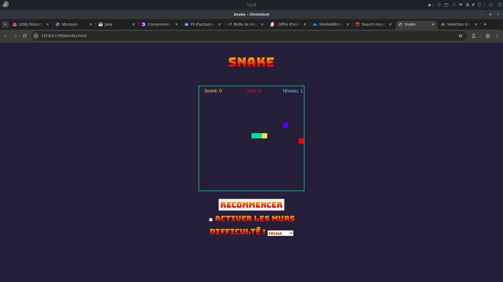

🐍 SnakeV2 – Mode Arcade Interactif 
 

 Dans le cadre de ma formation en développement web, j’ai réalisé un **Snake enrichi** intégrant des mécaniques modernes de gameplay, 
  telles que des bonus, des malus, différents niveaux de difficulté et une gestion avancée des collisions. 
  Ce projet m’a permis de manipuler le `canvas` en JavaScript, de gérer des boucles de jeu et d’implémenter des interactions utilisateur fluides. 

  
🎮 Fonctionnalités clés : 

-Déplacements dynamiques : Contrôle fluide via les touches fléchées ou ZQSD, avec détection des directions interdites.

-Pause et reprise : Utilisation de la barre espace pour interrompre ou continuer la partie à tout moment.

-Système de niveaux : Augmentation automatique de la difficulté à chaque palier de score atteint.

-Bonus / Malus aléatoires :

-Types : speed, live, score

-Effets : accélération ou ralentissement du serpent, gain ou perte de vies, boost de score.
  

-Modes de jeu : 

Facile (sans murs, 5 vies)

Normal (avec murs, 3 vies)

Difficile (avec murs, 1 vie)

-Mur ON/OFF : Le joueur peut activer ou désactiver les collisions avec les bords selon la difficulté choisie.

-Affichage HUD : Score, niveau, et nombre de vies affichés en direct.

 
 

 Envie d'essayer? https://alx-370.github.io/Projet-formation-PokedexV1/

## 🛠️Compérences :

